<div align="center">

# 📈 Stock Predictor

**Stock charts and experimental forecasts that show their own report card.**<br>
Every forecast ships with a walk-forward backtest against the "price stays flat" baseline, in plain language, including when the model fails.

[](https://github.com/RetnuhFeel/Stock-Predictor/actions/workflows/ci.yml)
[](LICENSE)
[](https://stock-predictor-web-ts7p.onrender.com)


**[Live demo](https://stock-predictor-web-ts7p.onrender.com)** · **[API](https://stock-predictor-api-2dnn.onrender.com/docs)** · **[Model report](https://stock-predictor-web-ts7p.onrender.com/model)** · **[Architecture](docs/ARCHITECTURE.md)**

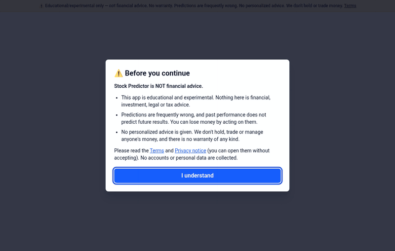

</div>

> ⚠️ **Educational/experimental only. Not financial advice. No warranty. Predictions are frequently wrong.** No personalised advice is given and this project does not hold or trade money. The [Terms](web/app/terms/page.tsx) and [Privacy](web/app/privacy/page.tsx) pages are draft templates that need review by a lawyer before you run a public service.

> ⏳ **Free-tier cold start:** the demo runs on Render's free plan, which sleeps after ~15 minutes idle. The first request can take up to a minute; the app shows a "Waking up the server…" banner and retries automatically.

## Why this exists

Most stock "predictors" show a confident line and nothing else. Short-horizon stock returns are close to random, so this project does the opposite: it builds a real forecasting pipeline and then **grades it in public**. On the [model report page](https://stock-predictor-web-ts7p.onrender.com/model) the model is backtested on SPY, AAPL, MSFT, NVDA and TSLA. When this was written it did **not** beat the naive baseline on any of them, and the page says so.

## Screenshots

| Light | Dark | Mobile |
|---|---|---|
| 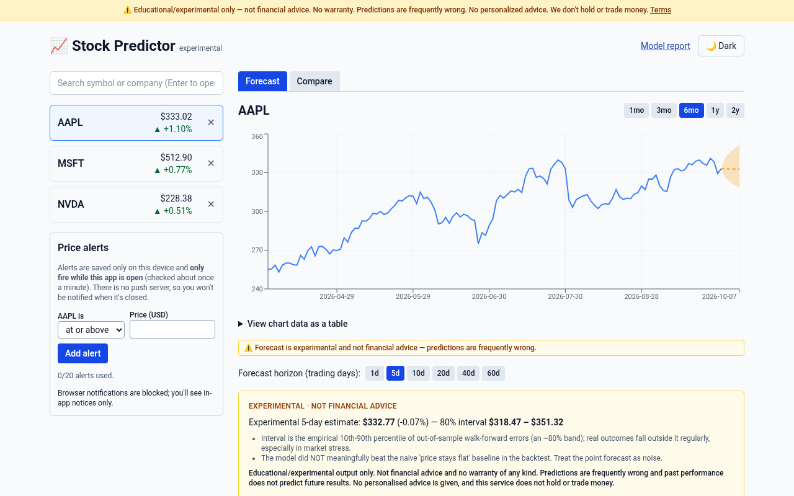 | 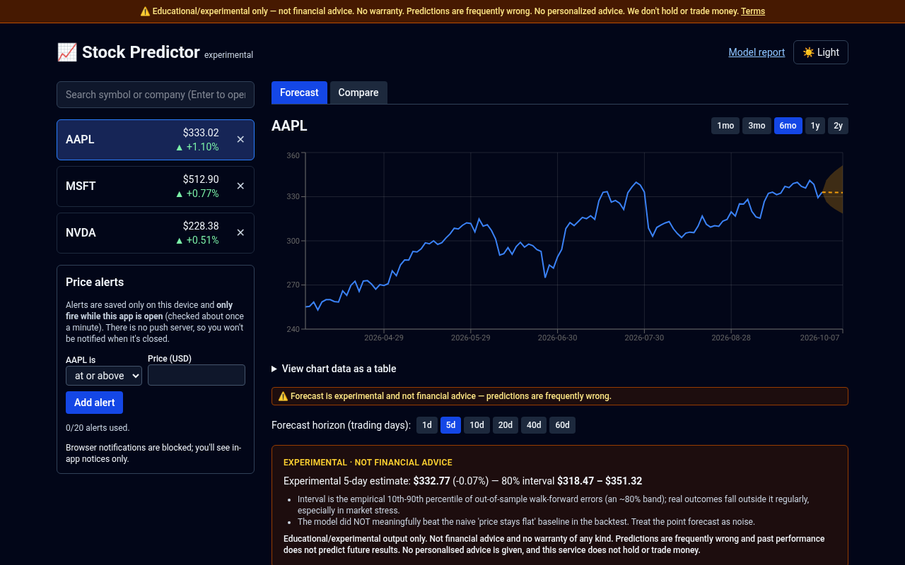 | 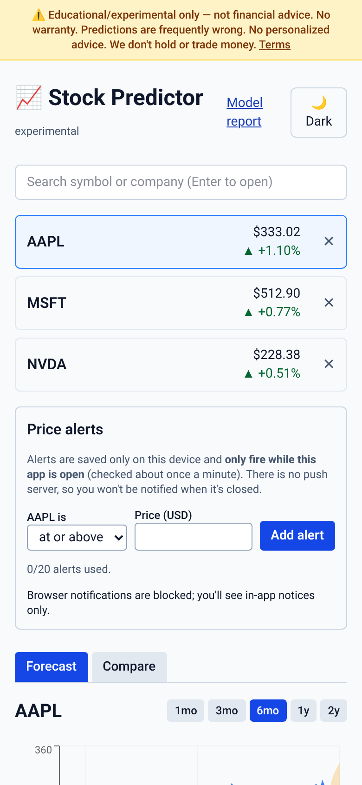 |
| 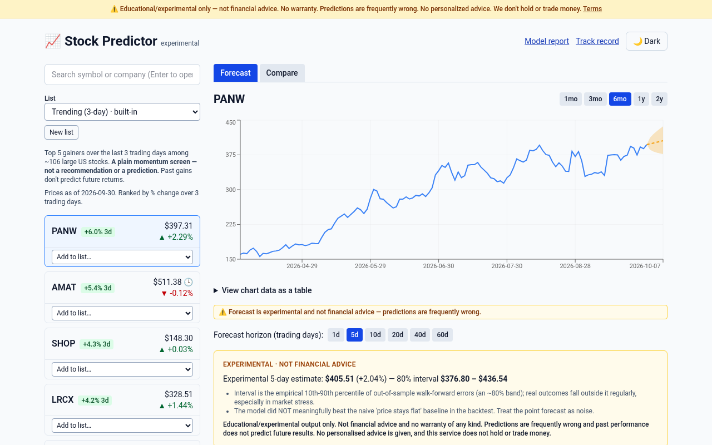 | 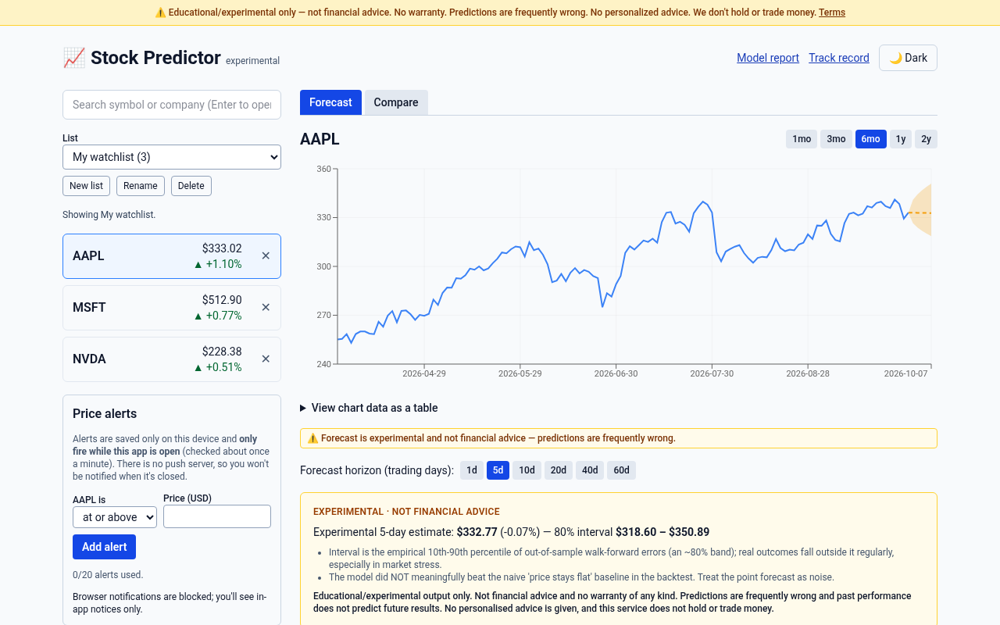 | 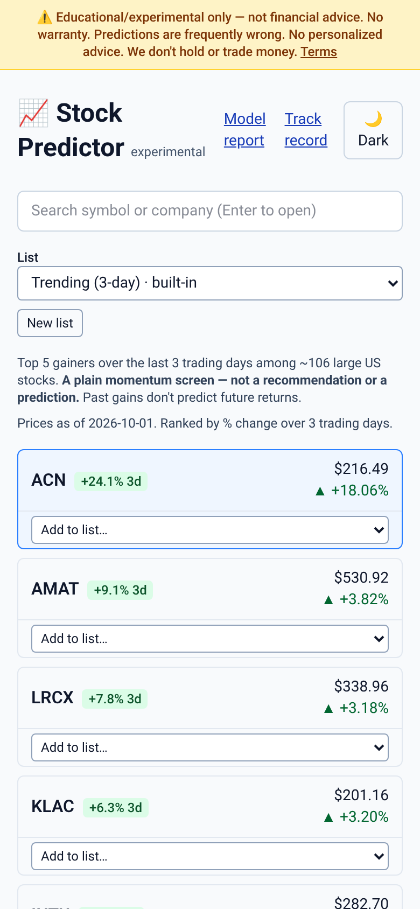 |
| 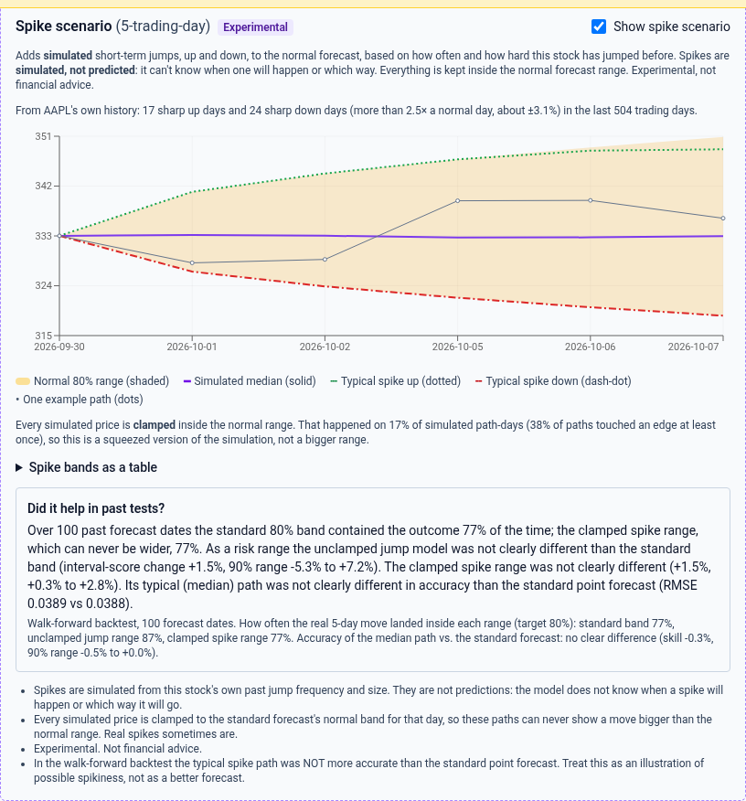 | | 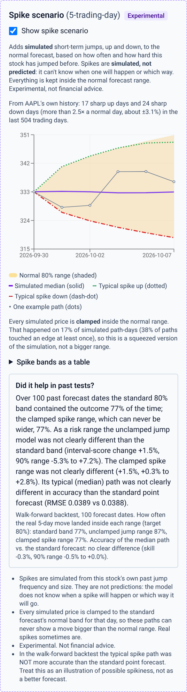 |
| 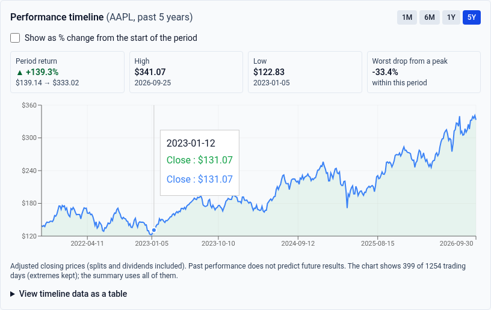 | 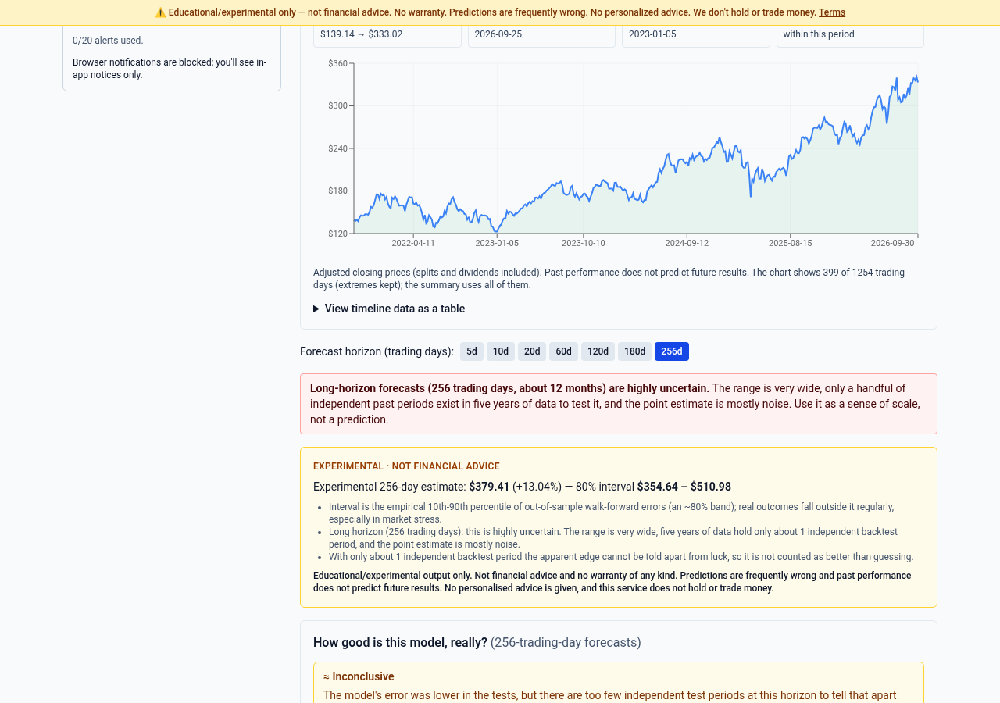 | 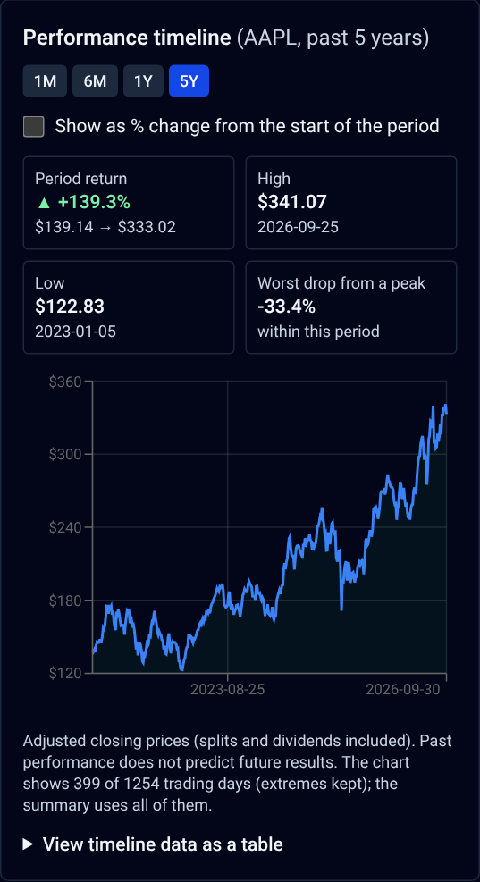 |
| 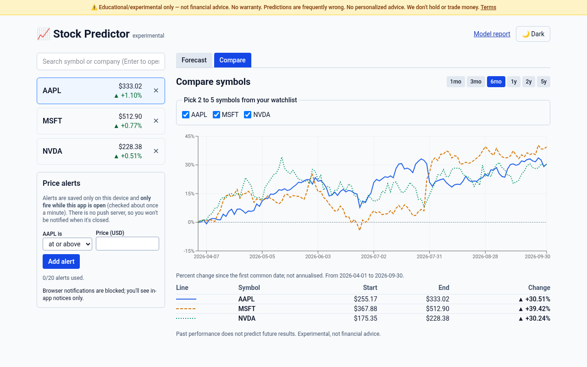 | 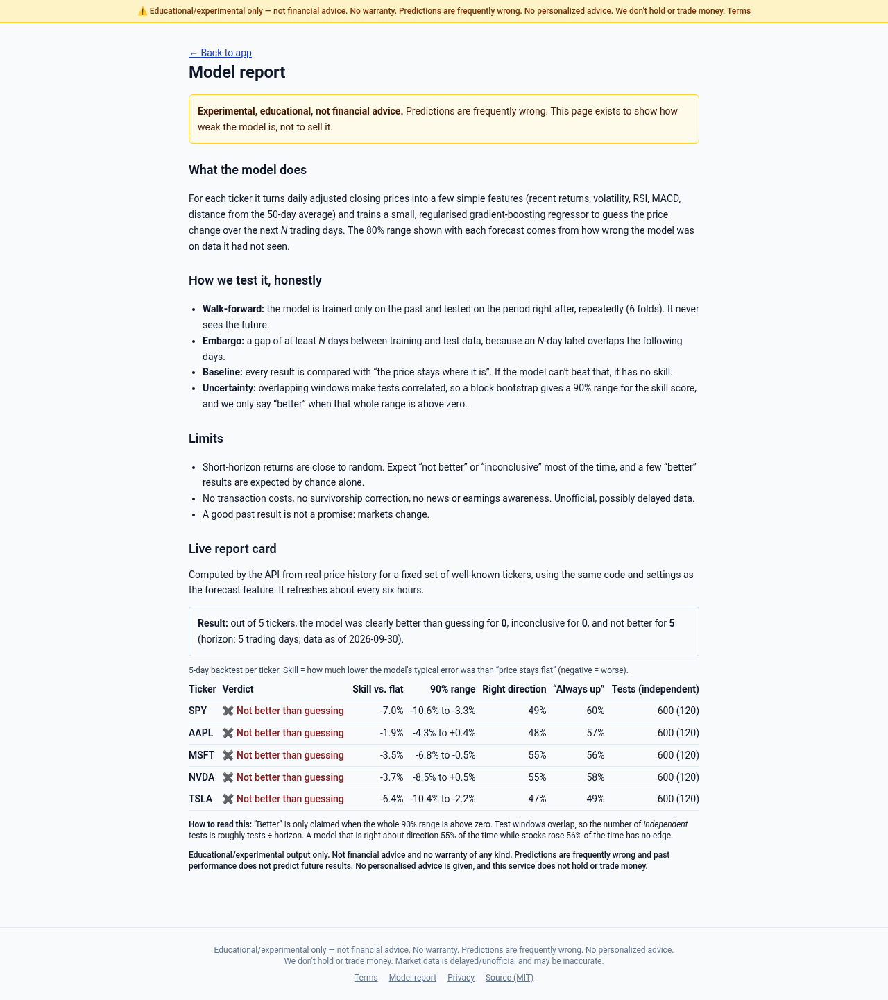 | 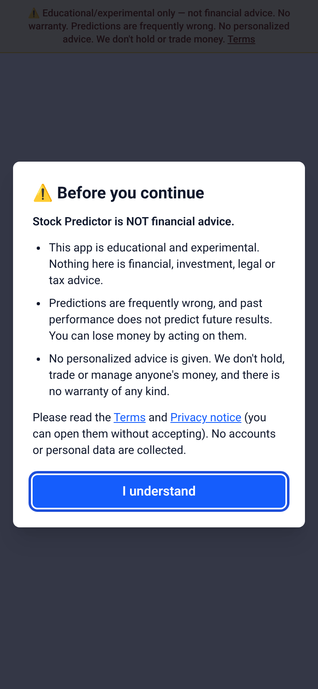 |

Screenshots and the GIF were generated by driving the built app in headless Chromium against the real backend (`web/e2e/screenshots.mjs`).

## Features

- **Forecasts with honest backtests:** 1–256 trading-day horizons (UI offers 5/10/20/60/120/180/256; long ones carry a prominent "highly uncertain" warning and can't earn a "better" verdict with fewer than 5 independent test periods); skill vs. "price stays flat", a 90% block-bootstrap range, direction hit-rate vs. a coin flip and vs. "always up", and a plain-language verdict (*Better / Inconclusive / Not better than guessing*) computed per horizon.
- **Public model report card** (`/model`): live backtest results for five well-known tickers, including where the model fails.
- **Model comparison:** naive, drift, EWMA, ridge-AR and gradient boosting graded by the same walk-forward + embargo test against "price stays flat"; it says plainly when nothing beats the baseline (and warns that one win out of several tries can be luck).
- **Expected range / risk:** realised-volatility forecast (EWMA, HAR-style) with a 1-sigma range and its own honest verdict and backtest coverage. Size of moves, not direction.
- **Live track record** (`/track-record`): a pre-registered, hash-chained log of real forecasts for a fixed ticker list, resolved after the horizon, with a live scorecard. No verdict until there are enough independent periods. Storage is ephemeral on the free tier (stated on the page; set `DATABASE_URL` for durability).
- **Performance timeline:** the selected ticker's closes over 1M / 6M / 1Y / **5Y (default)** with period return, high, low and worst drop from a peak, an optional % change view, a data table alternative and offline/loading/error states (`GET /api/timeline/{symbol}`, downsampled to ≤400 points server-side).
- **Experimental spike scenario** (off by default, clearly badged): a seeded jump-diffusion Monte Carlo calibrated from each stock's own sharp up/down days, with every simulated price clamped inside the normal forecast range. Spikes are *simulated, not predicted*. Its walk-forward backtest is shown next to it: in our checks it did **not** make the forecast more accurate. Not part of the live track record. See `docs/REFERENCE.md`.
- **Compare** up to 5 tickers as normalised % change, with a legend that doesn't rely on colour and a data table.
- **Price alerts:** stored only in your browser; they fire **only while the app is open** (no push server) and say so.
- **News headlines** for context (link-out only, clearly "not a signal").
- **Lists:** the default is a built-in, read-only **Trending (3-day)** list: the top 5 gainers over the last 3 trading days from a fixed, curated universe of ~106 liquid US large caps (`backend/app/universe.py`). It is a **plain momentum screen, not a recommendation or a prediction**; past gains do not predict future returns. You can also create, rename and delete your own lists (up to 20 lists × 50 tickers, saved in your browser, your last-selected list is remembered) and copy tickers from Trending into them. An existing watchlist is migrated into "My watchlist".
- **Installable PWA** that works offline: app shell plus last-known list data with an "offline / may be outdated" label.
- **Resilient by design:** stable error codes, freshness fields (`data_as_of`, `stale`, `is_delayed`), stale-if-error caching, retry/cold-start handling.
- **Accessible:** skip link, keyboard navigation, focus states, reduced motion, chart text alternatives and tables; axe-core checked in CI (light and dark).
- **Privacy-minded:** no accounts, cookies or trackers; optional, token-protected aggregate stats and sanitised error reports, all off by default.
- **Pluggable data providers:** `yfinance` (no key) or Twelve Data, behind one small interface.

## How the model works, and its limits

1. Daily adjusted closes → features: 1/5/10/21-day returns, 10/21-day volatility, RSI(14), MACD histogram, distance to the 50-day average.
2. Target: the log return over the next *h* trading days. Model: a small, regularised gradient-boosting regressor (fixed seed).
3. **Walk-forward validation** (expanding window, 6 folds) with an **embargo of at least *h* days** so training labels never overlap the test block, compared with the **naive persistence baseline**.
4. The 80% interval is the empirical 10th–90th percentile of out-of-sample errors. "Better" is claimed only when the whole 90% bootstrap range of the skill score is above zero.

Limits you should understand:
- Short-horizon returns are close to unpredictable; most of the time the model **does not beat** the baseline, and the UI says so. With many tickers and horizons, a few "better" results are expected by chance alone.
- Overlapping windows correlate test points, so metrics are indicative only; intervals ignore regime changes, earnings, news and crashes.
- Data is unofficial, daily and possibly delayed (`yfinance` can rate-limit or break); no transaction costs or survivorship modelling. This is not a trading system.

More detail: [docs/ARCHITECTURE.md](docs/ARCHITECTURE.md).

## Quick start

Backend (Python 3.12+):
```bash
cd backend
python -m venv .venv && source .venv/bin/activate
pip install -r requirements-dev.txt
pytest                      # synthetic data, no network needed
uvicorn app.main:app --reload --port 8000   # interactive docs at /docs
```

Web (Node 20.9+, 22 recommended):
```bash
cd web
cp .env.example .env.local   # NEXT_PUBLIC_API_BASE_URL=http://localhost:8000
npm ci
npm run dev                  # http://localhost:3000
npm run lint && npm run typecheck && npm run build
```

Docker: `docker compose up --build` (web on :3000, API on :8000).

Configuration (env vars, endpoints, providers, error codes, custom domain, deploying): **[docs/REFERENCE.md](docs/REFERENCE.md)**.

## Tech stack

| Layer | Tools |
|---|---|
| Web | Next.js 16 (App Router), React 19, TypeScript, Tailwind 4, Recharts, hand-written service worker |
| API | FastAPI, pandas, scikit-learn, SQLAlchemy (SQLite/Postgres), yfinance (or Twelve Data), in-memory TTL cache |
| Quality | pytest, ruff, ESLint, `tsc`, Playwright + axe-core, GitHub Actions, Dependabot |
| Hosting | Render (free tier) for the demo; any container host works |

## Project structure

```
backend/            FastAPI service (app/main.py, forecast.py, providers/, cache.py, freshness.py, observability.py) + pytest suite
web/                Next.js PWA (app/ routes, components/, lib/, public/sw.js)
web/e2e/            Headless-browser scripts: CI smoke + axe (mocked API), full checks, screenshot generator
docs/               ARCHITECTURE.md, REFERENCE.md, images, social preview
.github/            CI, keep-alive, daily prediction-log job, Dependabot, issue/PR templates, CODEOWNERS
StockAnalyzerApp/   Legacy iOS app (see below)
```

## Roadmap / follow-ups

- Optional newsletter or release-notes signup (not included; would need a privacy-reviewed provider).
- Web-side Sentry (documented as a follow-up to avoid bundle bloat).
- A licensed data provider for production use.
- Offline evaluation of pretrained time-series models (Chronos, TimesFM) with the same walk-forward harness; they are intentionally not in the API (too heavy for a free instance).
- Durable prediction-log storage (Postgres) and a longer live history.

## Contributing, security, support

See [CONTRIBUTING.md](CONTRIBUTING.md) and [SECURITY.md](SECURITY.md). If you find this useful, a ⭐ on the repo helps. The live app shows a "Support this project" link only if the operator configures one.

## Legacy iOS app

The original **SwiftUI** app (`StockAnalyzerApp/` and the root `*.swift`, `Models/`, `ViewModels/`, `Views/`) predates the web app and is kept for history. It is **not maintained** alongside the web work and is unchanged by it. It shows a watchlist (AAPL, GOOGL, TSLA) with the latest price, daily % change and a 7-day chart using [Finnhub](https://finnhub.io); it needs Xcode 14+ / iOS 16+ and a free Finnhub key set in `NetworkManager.swift` (`apiKey`). Never commit a real key. Known issue: the Swift sources are split between the repo root and `StockAnalyzerApp/`; consolidating them in Xcode is a pending follow-up.

## License

MIT, see [LICENSE](LICENSE).
