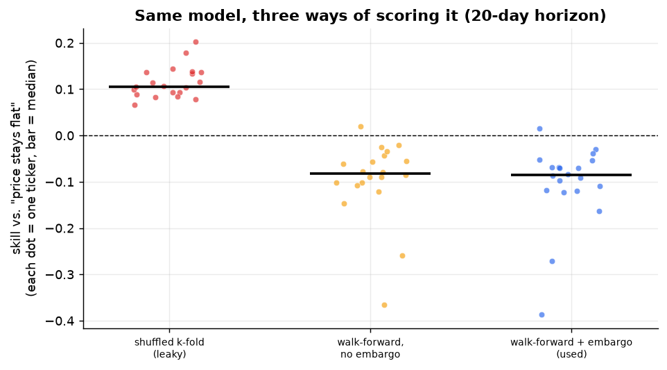
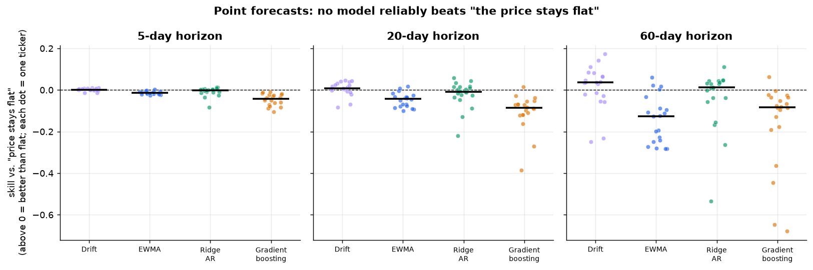
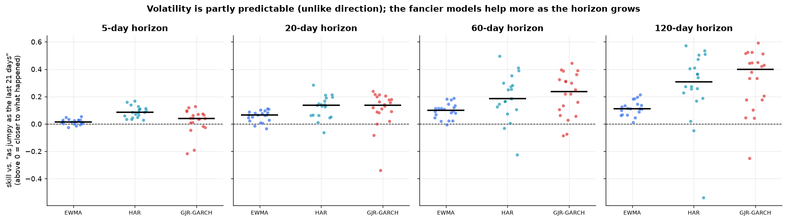
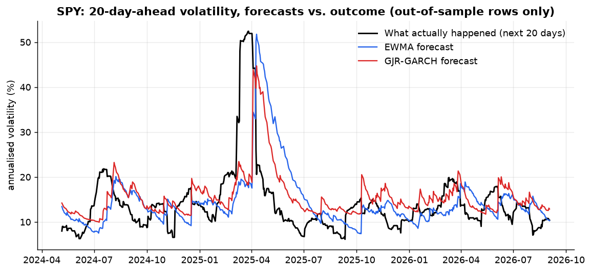
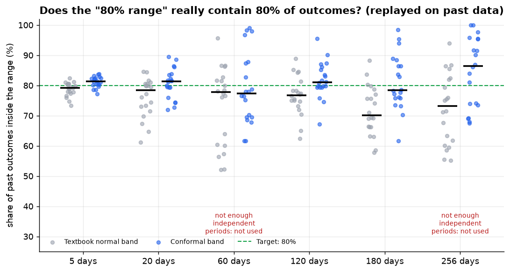

# Findings: can a model forecast stocks, and can it say honestly how sure it is?

*A methods-and-findings write-up for [Stock Predictor](../README.md). Every number, table and chart on this page is produced by [`analysis/run_analysis.py`](../analysis/run_analysis.py), which calls this repo's own backtest code. Nothing is typed in by hand (a test checks that the tables below match the saved results). Re-run it yourself with the commands in [`analysis/README.md`](../analysis/README.md).*

**Data and scope.** 20 liquid US-listed tickers (listed [below](#1-the-question-and-the-data)), daily adjusted closes from Yahoo Finance, **2021-10-04 to 2026-10-01** (1,254 trading days each; 10 years for the long-horizon interval calibration). Horizons from 5 to 256 trading days. Educational project; not financial advice.

---

## The short version (for a hiring manager)

I built a stock forecasting app, then used it to ask a harder question than "what will the price do?": **which of its claims survive an honest test?** I tested each claim only on data the model could not have seen, and the answers were mixed. That is the point of the project.

| Question | Answer, on 20 tickers over 5 years of data |
|---|---|
| Can the price models (gradient boosting, ridge regression, drift, moving average) predict where a stock goes better than "it stays where it is today"? | **No, not reliably.** Only {{better_point}} of {{n_point}} model-ticker-horizon tests cleared the bar for "better than flat", and the main gradient-boosting model never did (it was worse than flat on {{gbm_neg}}/20 tickers at 20 days). That count is no more than luck alone would produce. |
| Can it call the direction (up/down) better than "always say up"? | **No.** Right {{hit5}} / {{hit20}} / {{hit60}} of the time at 5 / 20 / 60 days, versus {{up5}} / {{up20}} / {{up60}} for "always up" (stocks mostly rose in this period). |
| Can it forecast *how bumpy* prices will be (volatility)? | **Partly, yes.** Volatility clusters, so every volatility model had a positive median skill versus "same as the last month" at every horizon, and a GJR-GARCH model helps most at 20 to 60 days (median error {{garch20}} / {{garch60}} lower than the moving-average default). It is **not** uniformly better: it was clearly worse on several tickers (e.g. NVDA, META, TLT). |
| Is the "80% range" really 80%? | **Close, with caveats.** Replayed on past data, the conformal range contained the real outcome {{cov5}} / {{cov20}} / {{cov120}} of the time at 5 / 20 / 120 days (median over tickers, target 80%), versus {{ncov5}} / {{ncov20}} / {{ncov120}} for the textbook normal-distribution range. At 60 and 256 days there is too little history to check, so the app refuses to claim it. |
| Does a careless evaluation fool you? | **Yes, badly.** The same gradient-boosting model shows a skill of **{{leak_leaky}} versus flat under shuffled cross-validation** (positive on 20/20 tickers) and **{{leak_honest}} under a walk-forward test** (positive on {{leak_honest_n}}/20). |

**What this does *not* show:** that the model beats the market. Market-beating returns and trading were never tested here (skill is forecast accuracy against "flat", not profit), and the return forecasts did not even clear that lower bar. The project's live prediction log is only days old, so there is no live evidence yet either way ([how it will be judged](#7-how-the-live-prediction-log-will-be-evaluated-placeholder-no-results-yet)).

**Skills shown:** framing a forecasting question with a baseline that is hard to beat, time-series validation without look-ahead leakage, bootstrap confidence intervals and multiple-testing awareness, calibration checks (coverage) for uncertainty estimates, volatility modelling (EWMA, HAR, GJR-GARCH), reproducible Python, and writing negative results plainly.

---

## 1. The question and the data

**Question.** For a stock, over the next *h* trading days, can a model (a) predict the return better than a trivial baseline, (b) predict how volatile it will be, and (c) give a range that contains the true outcome as often as it claims (80% of the time)?

**Baseline.** "Naive" = the price stays flat (predicted return 0). It is a deliberately tough bar for daily-frequency data, because most of the day-to-day movement is unpredictable. A model only counts as useful if it beats this *out of sample*.

**Skill score.** `skill = 1 - (model error / naive error)`, using root-mean-square error (RMSE). 0% = no better than flat; +10% = 10% smaller error; negative = worse than doing nothing.

**Data.** Yahoo Finance daily adjusted closes via `yfinance` (unofficial, can be revised later; the exact window is recorded in [`analysis/results/summary.json`](../analysis/results/summary.json)). Raw prices are not committed (to avoid redistributing vendor data), only the derived results; the script re-downloads and caches them locally.

- Window: **2021-10-04 to 2026-10-01** (1,254 trading days per ticker). The 120+ day interval calibration uses 10 years ending the same day.
- Tickers (20): SPY, QQQ, AAPL, MSFT, NVDA, TSLA, AMZN, GOOGL, META, JPM, KO, XOM, PFE, JNJ, PG, WMT, UNH, XLE, TLT, GLD. Large, liquid names chosen up front (index funds, tech, banks, staples, energy, healthcare, bonds, gold), not picked after seeing results.
- Biases to keep in mind: these are survivors (companies that are still big today), and 2021 to 2026 is a single market regime. See [limitations](#6-honest-limitations).

## 2. The models

| Part | Models | In plain terms |
|---|---|---|
| Point forecast (return over *h* days) | **Naive** (flat), **Drift** (average past return), **EWMA** (recent average return), **Ridge AR** (linear regression on past returns and volatility), **Gradient boosting** (the app's main model; a small, heavily regularised tree ensemble on 1/5/10/21-day returns, volatility, RSI, MACD, distance to the 50-day average) | From "do nothing" up to a machine-learning model. If the complex ones cannot beat the simple ones, the extra complexity is not earning its keep. |
| Volatility (how bumpy, over *h* days) | **Naive** (last 21 days), **EWMA** (RiskMetrics, λ = 0.94; the app's headline), **HAR** (regression on 5/22/66-day volatility), **GJR-GARCH(1,1)** (volatility that reverts to a long-run level and reacts more to drops than to rises) | Volatility is more predictable than direction because calm and stormy periods persist. The question is whether the fancier models add anything over a simple moving average. |
| Uncertainty (the 80% range) | **Textbook normal band** (EWMA volatility × 1.28 × √*h*) and **split conformal** (the same band, but its width multiplier is learned from how wrong the model really was in the past, using only information available at the time) | A claimed "80% range" is only worth something if reality lands inside it about 80% of the time. Conformal prediction is a way to make that true without assuming returns are normally distributed. |

## 3. How the models are tested (and why)

Financial data punishes sloppy validation. The rules used here, all in `backend/app/forecast.py`:

1. **Walk-forward, never shuffled.** Train on the past, test on the next block of dates, then roll forward (6 expanding-window folds, testing on roughly the second half of history; for the 5-year window that is about **May 2024 to Sept 2026**). Random train/test splits let the model peek at the future.
2. **An embargo of at least *h* days.** A row's label is the return over the *next h* days, so a training row from just before the test block shares most of its label window with test rows. Training stops *h* days before each test block so no label overlaps.
3. **Independent periods, not rows.** Overlapping *h*-day windows are highly correlated, so a 20-day backtest on 600 daily rows is worth about 29 independent tests, not 600. Confidence intervals use a block bootstrap, and with fewer than 5 independent periods the code refuses to ever say "better".
4. **A pre-declared baseline and verdict rule.** "Better" needs skill above 2% *and* a 90% bootstrap range entirely above zero. Otherwise "inconclusive" or "not better".
5. **Interval checks look backward only.** The conformal replay recomputes its multiplier at every past date using only outcomes already known then, and counts the share of real outcomes that landed inside.

**Why the leakage matters, with numbers.** The chart below scores the *same* gradient-boosting model three ways at a 20-day horizon on all 20 tickers.

{{table:leakage}}

*Shuffled k-fold shows "skill" on every ticker because neighbouring days have overlapping 20-day labels, so the model effectively sees the answer. Honest walk-forward scoring says the model is worse than flat. Dropping the embargo changed this particular model very little (a small, heavily regularised model), but that is a property of this model, not a reason to skip it.*

## 4. Results

### 4.1 Return forecasts: nothing reliably beats "flat"

Skill versus the flat baseline, 20 tickers, by horizon. Verdict counts are out of 20 tickers.

{{table:point}}

- The main model (gradient boosting) was **never** better than flat; its median skill was {{gbm5}} / {{gbm20}} / {{gbm60}} at 5 / 20 / 60 days.
- "Drift" did best (median {{drift60}} at 60 days, "better" on 5 tickers: SPY, QQQ, GOOGL, JPM, JNJ), but this is not forecasting skill. Drift just assumes stocks keep rising, and in this window they mostly did; the flat baseline assumes zero. It would have failed in a falling market.
- Of {{n_point}} tests, {{better_point}} were rated "better". With a 90% interval, roughly 1 in 20 tests clears the bar by luck, so about 12 wins would be expected from chance alone (a rough figure; overlapping windows make tests dependent). **This is no evidence of skill.**

Direction (did the model get up/down right?), median over tickers, gradient boosting:

{{table:direction}}

*The model's direction call was worse than saying "up" every time, because stocks rose more often than they fell in this sample.*

### 4.2 Volatility: partly predictable, and the fancy model is not a clear winner

Skill versus "volatility will be the same as the last 21 days" (higher is better). The right-hand columns compare each model with the EWMA headline, counting tickers where the difference is clearly better or clearly worse.

{{table:volatility}}

- **Volatility is forecastable in a way direction is not**: medians are positive for every model at every horizon.
- **GJR-GARCH helped most at 20 to 60 days** (median error {{garch20}} and {{garch60}} lower than EWMA; clearly better on {{g20b}} and {{g60b}} of 20 tickers, clearly worse on {{g20w}} and {{g60w}}). That fits its design: it lets volatility drift back to a long-run level, while EWMA stays flat.
- **At 5 days it was a coin flip** ({{g5b}} clearly better, {{g5w}} clearly worse).
- **HAR was a surprise at 5 days**: clearly better than EWMA on {{h5b}} of 20 tickers and worse on none, which GARCH did not match. HAR was not the pre-declared headline, so I do not promote it on the strength of this one table (that would be choosing the winner after looking). It is a candidate for the live log.
- **Where GARCH lost**: NVDA (about −18% at 5 days, −30% at 20), META (about −25% / −20%), and TLT (the bond ETF, worse at 5, 20, 60 and 120 days).
- **At 120 days nothing can be called "better"** whatever the point estimate says, because 5 years of data hold only about 4 independent 120-day windows. The large median numbers there should not be trusted.

A single-ticker illustration (SPY, 20-day horizon, out-of-sample rows only, 2024-05-06 to 2026-09-02). SPY was chosen as the most familiar ticker, and it is one example, not evidence by itself. On SPY, GJR-GARCH's error was 14.2% below "last 21 days" and 13.7% below EWMA (rated "better").

### 4.3 The 80% range: conformal is closer to honest than the textbook band

Share of past outcomes that landed inside the claimed 80% range, replayed on the same dates for both methods (median across 20 tickers, with the lowest and highest ticker in brackets). "Range used" is how many tickers passed the app's own gate (at least 8 independent test periods and no clear under-coverage).

{{table:conformal}}

- At 5, 20 and 120 days the conformal median is ≈{{cov5}}, {{cov20}}, {{cov120}}: near the 80% target. The textbook band comes in lower ({{ncov5}}, {{ncov20}}, {{ncov120}}) and gets worse at 180 days ({{ncov180}} vs {{cov180}}).
- The price of honesty is width: the conformal multiplier is typically 1.33 to 1.59, versus 1.28 for the textbook band, i.e. wider ranges.
- Individual tickers vary a lot (for example {{cmin20}} to {{cmax20}} at 20 days, and wider still at longer horizons, where only 9 to 16 independent periods stand behind each number). A median near 80% does not mean every ticker's range is calibrated.
- **At 60 and 256 days the app does not use conformal** (about 6 and 5 independent periods). The coverage shown in the chart for those horizons is a rough diagnostic only and should not be read as validation.

## 5. What did not work, or is inconclusive

- **Return prediction.** None of the point models, including the machine-learning model, beat "flat" in a way distinguishable from luck. The README already reports this for 5 tickers; the larger 20-ticker test here agrees.
- **Direction.** Worse than "always up".
- **GARCH over EWMA at 5 days:** no clear difference. **At 120 days:** inconclusive by construction (too few independent periods).
- **Conformal at 60 and 256 days:** cannot be validated with five years of data, so it is switched off there, and 180 days has a median coverage of {{cov180}} (a few tickers well below 80%).
- **The experimental "spike scenario"** (a jump-diffusion overlay on the forecast range) was tested separately on 5 tickers and 2 horizons; its typical path was never clearly more accurate than the standard forecast (all 10 comparisons inconclusive). The details are in [`docs/REFERENCE.md`](REFERENCE.md) and were *not* regenerated for this page.
- **A bug I found by testing:** an earlier version of that spike backtest calibrated each origin on data from an earlier date than the one being forecast (an index mix-up), which flattered its results. It was caught, fixed and the table was replaced (also documented in the reference). Reproducible evaluation code is what makes a mistake like this findable.

## 6. Honest limitations

- **One market regime.** 2021-10 to 2026-10, mostly rising, with the April 2025 shock the main stress episode. Results may not hold in other regimes.
- **Survivorship and selection.** 20 large, liquid names that exist today. No delisted companies, no small caps, no non-US markets.
- **Small effective samples.** Overlapping windows mean 60-day results rest on about 9 independent periods and 120-day results on about 4. Medians over 20 tickers are not 20 independent experiments either: the tickers move together.
- **Multiple comparisons.** 4 point models × 3 horizons × 20 tickers = 240 tests; some "wins" are expected by chance, and I report the count rather than the best cases.
- **Data quality.** Yahoo Finance is unofficial, adjusted prices can be revised, and a re-run on a different date can differ slightly. The committed results record the exact window used.
- **No costs or trading.** Skill here is forecast accuracy (RMSE), not profit. There are no transaction costs, taxes, slippage or position sizing, and this is not a trading strategy.
- **Coverage is a replay.** The conformal coverage is measured on history, with the same tickers used to build and judge the method. It is not a guarantee about the future, and conformal guarantees assume past and future errors are exchangeable, which markets violate in crashes.

**What I would do next**

1. Let the live log accumulate and evaluate it as described below (the real test).
2. Compare HAR with EWMA as the volatility headline *on the live log*, since the table above is only a hint.
3. Add more regimes and markets (2008, 2020, non-US, small caps) and include delisted names.
4. Evaluate pretrained time-series models (Chronos, TimesFM) offline with the same walk-forward harness, and only add one if it beats the baselines.
5. Move the prediction log to the conformal interval, as a deliberate versioned change so its history stays comparable.
6. Add a cost-aware backtest if a trading question is ever asked (it is not today).

## 7. How the live prediction log will be evaluated (placeholder: no results yet)

**Status: no results yet.** The app records a fixed 5-day-horizon forecast for SPY, AAPL, MSFT, NVDA and TSLA each weekday (22:30 UTC) in a public, hash-chained log. The first predictions were made on 2026-10-01, so the first outcomes are due about 5 trading days later. **Nothing from the live log is reported here, and this page does not claim the model works.**

How it will be judged, using the app's existing scorecard (`backend/app/trackrecord.py`), written down *before* the data arrives:

| Measure | Definition | What would count as evidence |
|---|---|---|
| Skill vs. flat | `1 − RMSE(model) / RMSE(flat)` on resolved predictions, one score per forecast date (averaged over tickers so same-day tickers do not count as independent) | Skill above 2% **and** the 90% block-bootstrap range entirely above 0 |
| Direction hit rate | Share of predictions with the right up/down sign, compared with the share of outcomes that were simply "up" | Beat "always up", not just 50% |
| 80% range coverage | Share of outcomes inside the logged interval (the legacy band, which the log was started with) | Roughly 80%, judged with its plausible range, not the single number |
| Minimum sample | At least 30 independent periods (forecast dates ÷ 5), which is about 150 logged weekdays, so no earlier than roughly May 2027 | Before that the scorecard says "too early" and this page will not draw a conclusion |

When enough data exists, this section will be replaced with the scorecard, the date range and the tickers, with failures reported the same way as successes. Because the log is a public hash chain, anyone can verify that earlier entries were not edited.

---

*Reproduce: see [`analysis/README.md`](../analysis/README.md). Generated from `master` at commit `{{commit}}` plus this analysis code. Run time ≈ {{seconds}} s on a laptop-class machine, with cached prices.*
