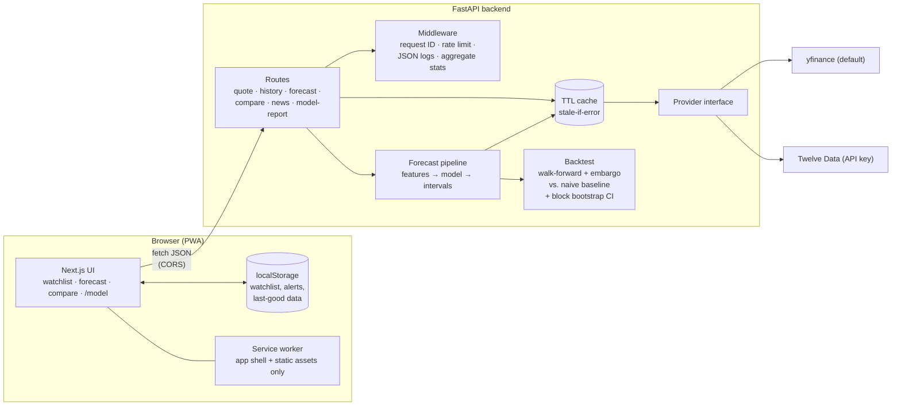
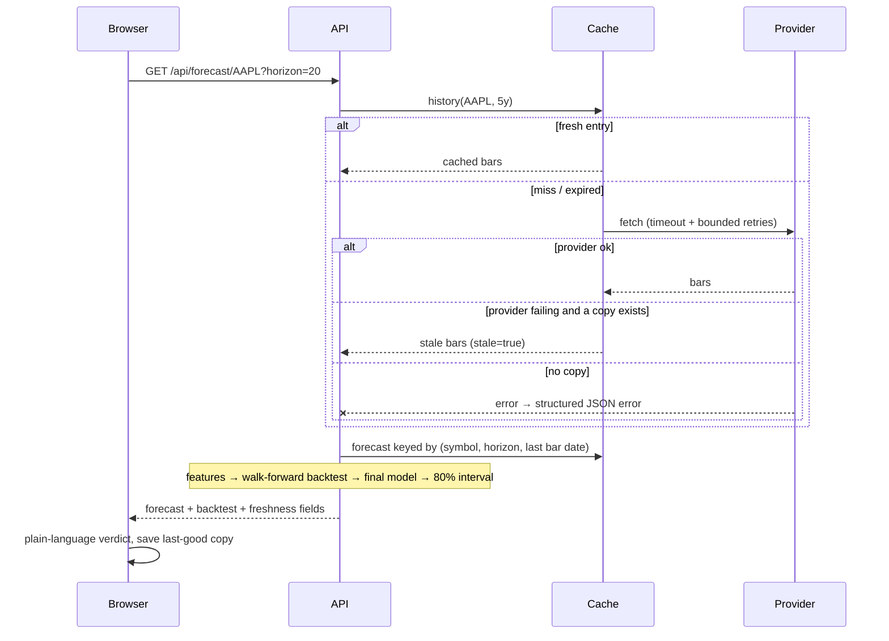

# Architecture

> ⚠️ Educational/experimental only. Not financial advice. Predictions are frequently wrong.

## Overview

## Request flow for a forecast

## Components

| Component | Where | Notes |
|---|---|---|
| Web app | `web/` | Next.js App Router, static pages + client components; all data fetched from the API |
| API | `backend/app/main.py` | Thin routes; errors are `{"error": {code, message, retryable, retry_after}}` |
| Provider abstraction | `backend/app/providers/` | `BaseProvider` (`history`, `search`, `news`); `create_provider(DATA_PROVIDER)` |
| Cache | `backend/app/cache.py` | In-memory TTL cache, stale-if-error up to `STALE_MAX_AGE_S`; single-process |
| Freshness | `backend/app/freshness.py` | `data_as_of`, `fetched_at`, `is_delayed`, `stale`, `warnings` |
| Forecast + backtest | `backend/app/forecast.py` | Gradient boosting on simple features; walk-forward CV; bootstrap CI |
| Model report | `GET /api/model-report` | Fixed ticker list and horizon, cached 6 h, own rate limit, builds serialised |
| Observability | `backend/app/observability.py` | Request IDs, JSON logs without IPs, opt-in aggregate stats and client error log |

## Design decisions

**Walk-forward validation with an embargo.** Random k-fold would let the model train on days adjacent to (and overlapping the labels of) its test days, which flatters the score. Walk-forward trains only on the past and tests on what follows, like real use. Because an *h*-day label spans *h* future days, a gap (embargo) of at least *h* days separates train and test so no label overlaps both. Test windows still overlap each other, so we also report roughly how many *independent* tests there are (tests ÷ *h*) and flag small samples.

**Compare against an honest baseline.** A model's error number means little alone. The baseline "price stays where it is" is hard to beat at short horizons, so every forecast reports *skill* = 1 − model error / baseline error, with a 90% block-bootstrap range that respects overlap. "Better" requires the whole range above zero; otherwise the UI says "Inconclusive" or "Not better than guessing". The public report card applies the same rule to fixed tickers so results can't be cherry-picked.

**Error and freshness model.** Every non-2xx response has one shape with stable codes (`INVALID_SYMBOL`, `DATA_UNAVAILABLE`, `UPSTREAM_TIMEOUT`, `RATE_LIMITED`, …) so the UI can show friendly messages and decide whether to retry. Every data response says how old it is. If the provider fails but a recent copy exists, the API serves it flagged `stale` rather than failing, and the UI labels it "may be outdated".

**Offline strategy.** The service worker caches only the app shell and hashed static assets (network-first navigations with an offline fallback). It never touches `/api` and never stores error responses, so it can't serve stale or broken API data by accident. "Last known" data lives in `localStorage`, written by the page after a successful fetch, and is always shown with an outdated label when it isn't live.

**Privacy by construction.** No accounts or cookies; watchlist and alerts stay on the device. Server logs omit IPs, user agents and query strings; stats are in-memory aggregates behind an admin token; client error reports are opt-in, sanitised, size- and rate-limited.

**Bounded cost.** The only compute-heavy public endpoints are forecast (cached per symbol/horizon/day) and the model report (fixed inputs, cached, serialised, stricter rate limit). The in-memory cache and rate limiter assume one instance; move them to Redis before scaling out.

## Known limits

Unofficial daily data; no transaction costs, survivorship correction or event awareness; in-memory state resets on restart; single-process assumptions.
